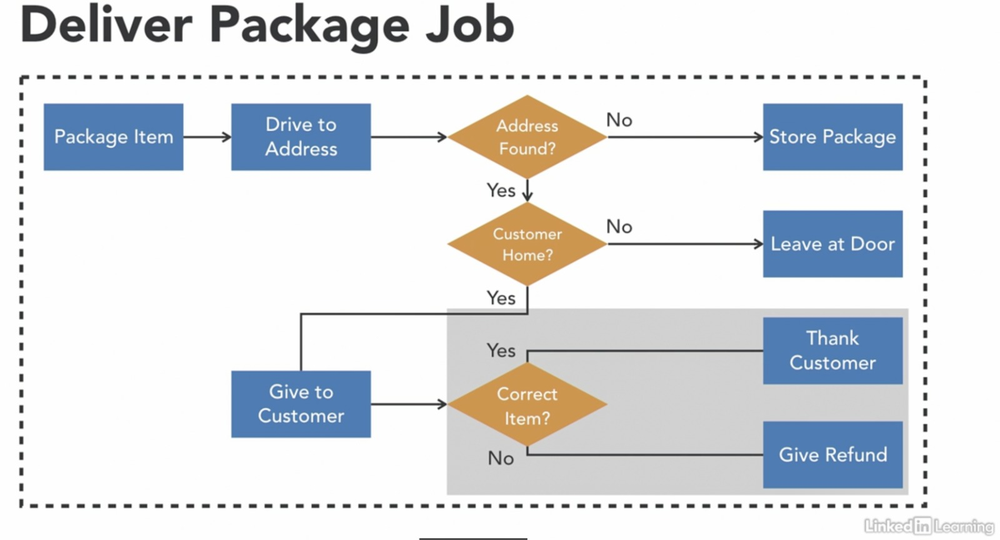

# Spring Batch - Creating Conditional Flow

This demo code shows that codeversion of below flow

### Reference Documentation

For further reference, please consider the following sections:

* [Spring Batch](https://docs.spring.io/spring-boot/docs/2.7.0/reference/htmlsingle/#howto-batch-applications)

